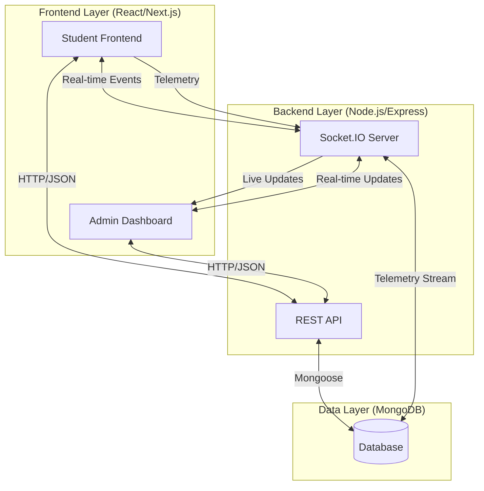

# 🎓 CognitoMark: High-Fidelity Exam Portal

A state-of-the-art, real-time examination platform with advanced telemetry, granular behavior tracking, and a premium administrative dashboard. Built for reliability, precision, and a seamless user experience.


---

## 🏛️ Project Structure

This repository is organized as a mono repo containing both the frontend and backend components.

| Directory                 | Description                                  | Documentation                           |
| :------------------------ | :------------------------------------------- | :-------------------------------------- |
| [`frontend/`](./frontend) | Next.js application for students and admins. | [Frontend README](./frontend/README.md) |
| [`backend/`](./backend)   | Express.js server and MongoDB integration.   | [Backend README](./backend/README.md)   |

---

## 📊 Total System Architecture



---

## 🚀 Key Features

### 📡 Real-Time Administration

- **Live Updates**: Instant notification of student registrations and submissions via Socket.IO.
- **Dynamic Dashboard**: Real-time refreshing of Students and Sessions tabs.

### 🖱️ Advanced Telemetry & Tracking

- **High-Fidelity Click Tracking**: Captures all user clicks across the entire session.
- **Integrity Monitor**: Detection of tab switching and window minimizing.
- **Fullscreen Enforcement**: Auto-enters fullscreen for exams.

### 💎 Premium User Experience

- **Vibrant UI**: Sleek dark mode with glassmorphism effects.
- **Responsive Navigation**: Collapsible sidebar with high-quality micro-animations.

---

## 🛠️ Getting Started

To get the entire system running locally, follow these steps:

### 1. Clone the repository

```bash
git clone https://github.com/your-repo/CognitoMark.git
cd CognitoMark
```

### 2. Setup Backend

Detailed instructions in [backend/README.md](./backend/README.md).

```bash
cd backend
npm install
npm run dev
```

### 3. Setup Frontend

Detailed instructions in [frontend/README.md](./frontend/README.md).

```bash
cd frontend
npm install
npm run dev
```

---

_Developed with a focus on visual excellence and behavioral precision._
