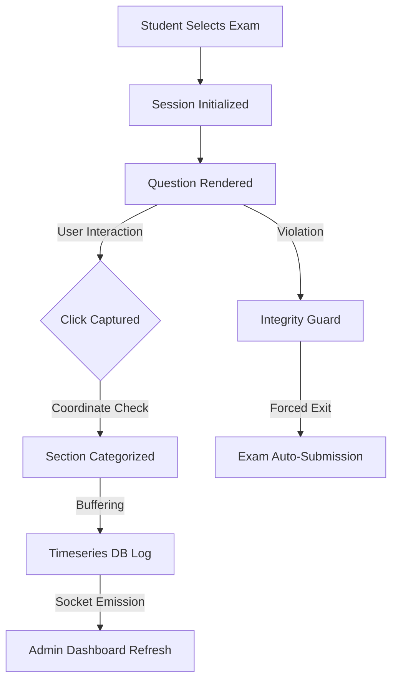

# 🎓 High-Fidelity Exam Portal

A state-of-the-art, real-time examination platform with advanced telemetry, granular behavior tracking, and a premium administrative dashboard. Built for reliability, precision, and a seamless user experience.

---

## 🚀 Key Features

### 📡 Real-Time Administration

- **Live Updates**: Instant notification of student registrations, exam starts, and submissions via Socket.IO.
- **Dynamic Dashboard**: Real-time refreshing of the Students and Sessions tabs without manual reloads.
- **Empty States**: Clean, user-friendly messages for a polished look when data is empty.

### 🖱️ Advanced Telemetry & Tracking

- **High-Fidelity Click Tracking**: Captures all user clicks across the entire session, including background clicks.
- **Granular Categorization**: Clicks are automatically logged into specific sections: Header, Integrity Monitoring, Stress Bar, Question Area, and Navigation.
- **Sequential Answering**: Enforced logical flow where students must answer the current question to proceed.
- **Integrity Monitor**: Real-time detection of tab switching, window minimizing, and fullscreen exits with a configurable violation threshold.

### 💎 Premium User Experience

- **Vibrant UI**: Sleek dark mode with glassmorphism effects and modern typography.
- **Custom Components**: Premium confirmation modals and designer dropdowns replacing standard browser defaults.
- **Responsive Navigation**: Collapsible sidebar with high-quality micro-animations.

### 🛠️ Technical Stack

- **Frontend**: Next.js 16 (Turbopack), React 19, Socket.IO Client, Axios.
- **Backend**: Express.js, Socket.IO, MongoDB, JWT Authentication.
- **Database**: High-precision timeseries logging for telemetry data.

---

## 📂 Project Structure

| Directory                 | Description                                                  |
| :------------------------ | :----------------------------------------------------------- |
| `frontend/src/app`        | Next.js App Router pages and layouts.                        |
| `frontend/src/screens`    | Core view components (Student Login, Exam, Admin Dashboard). |
| `frontend/src/components` | Reusable UI (ConfirmModal, Sidebar, ProtectedRoute).         |
| `frontend/src/api`        | API client wrappers for frontend-backend communication.      |
| `backend/src/controllers` | Business logic for exams, students, and administration.      |
| `backend/src/db`          | Database bootstrap and high-fidelity timeseries logs.        |
| `backend/src/sockets`     | Real-time event orchestration.                               |

---

## 🛠️ Getting Started

### Prerequisites

- Node.js (v24.12+)
- npm / pnpm / yarn

### Installation

1. **Clone the repository**
2. **Setup Backend**
   ```bash
   cd backend
   npm install
   # Create a .env file based on .env.example
   npm run dev
   ```

3. **Setup Frontend**
   ```bash
   cd frontend
   npm install
   # Create a .env file based on .env.example
   npm run dev
   ```

### Environment Variables

#### Backend (`backend/.env`)

- `PORT`: Server port (default: 5000)
- `JWT_SECRET`: Security key for admin authentication
- `CLIENT_ORIGIN`: Frontend URL for CORS (e.g., http://localhost:3000)
- `MONGODB_URI`: MongoDB connection string

#### Frontend (`frontend/.env`)

- `NEXT_PUBLIC_API_URL`: Backend API endpoint
- `NEXT_PUBLIC_SOCKET_URL`: Backend Socket.IO endpoint

---

## 📊 Way of Working: Telemetry Flow



---

## 🛡️ Security & Integrity

- **JWT Protection**: All admin routes are secured via JSON Web Tokens.
- **SSR Safety**: Robust guards for client-side storage access during Server-Side Rendering.
- **Sequential Guard**: Backend verification ensures questions are answered in the correct order.

---

_Developed with a focus on visual excellence and behavioral precision._
